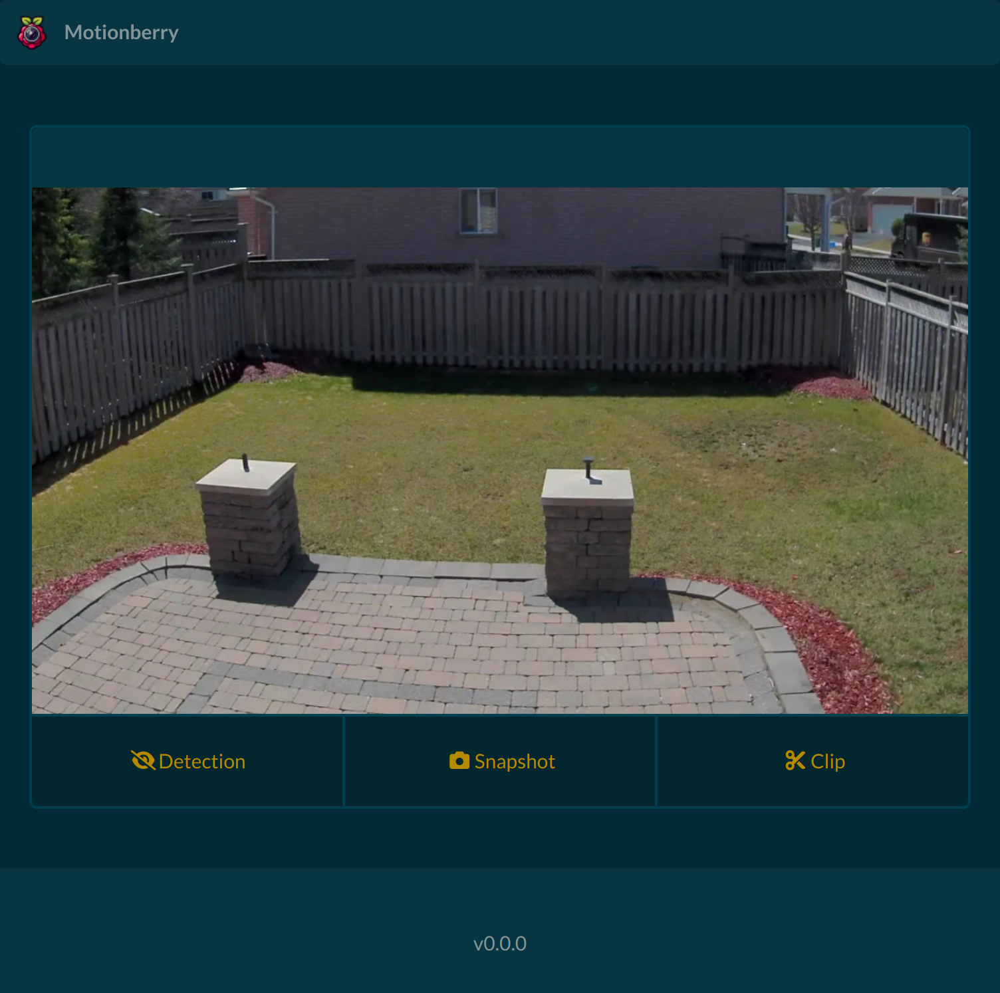

# Motionberry

A lightweight solution for motion detection and video streaming on Raspberry Pi, powered by [picamera2](https://github.com/raspberrypi/picamera2).

**Tested and optimized for Raspberry Pi Zero 2W with a Camera module v3**

## Features v0.1.0

- Support for Dockerized or bare-metal deployments
- Responsive user interface
- Motion-triggered recording
- Triggerable snapshots (JPEG)
- Output in raw H.264 or MP4 format
- API and webhook event integration

<div align="center">
  
</div>


## Pre-requisites

- A Raspberry Pi (tested on Raspberry Pi Zero 2W and compatible with other models)
- A camera module compatible with picamera2 (e.g., Raspberry Pi Camera Module 3).
- Raspberry Pi OS 64-bit (Bullseye recommended)

## Docker installation
To install Motionberry using Docker on your Raspberry Pi, follow these steps:
1. Install [Docker](https://docs.docker.com/engine/install/debian/)
1. Run the following command to deploy Motionberry:
   ```bash
   docker run --name motionberry \
     --privileged \
     -e PUID 1000 \
     -e PGID 1000 \
     -v <path to config.yml>:/motionberry/config \
     -v <path to capture directory>:/motionberry/captures \
     -v /run/udev:/run/udev:ro \
     -p 5000:5000 \
     j3ko/motionberry:latest
   ```

Explanation of Options:

- `--privileged`: Required for hardware access, such as the camera module.
- `-e PUID` / `-e PGID`: Set user and group IDs to match your system's user permissions.
- `-v <path>`: Map local directories to container paths:
  - `<path to config.yml>`: Path to your configuration file.
  - `<path to capture directory>`: Directory where captures will be stored.
- `-p 5000:5000`: Maps port 5000 on the host to the container.

Replace `<path to config.yml>` and `<path to capture directory>` with appropriate paths on your host machine.

## Bare metal installation
To install and run Motionberry natively on your Raspberry Pi, follow these steps:
1. Install the required libraries:
   ```bash
   sudo apt install -y --no-install-recommends \
    git \
    ffmpeg \
    python3-dev \
    python3-venv \
    python3-pip \
    python3-numpy \
    python3-picamera2
   ```
1. Clone the repository:
   ```bash
   git clone https://github.com/j3ko/motionberry.git
   ```
1. Set up a virtual environment:
   ```
   cd motionberry
   python3 -m venv --system-site-packages .venv
   . .venv/bin/activate
   pip install --upgrade pip
   pip install .
   ```
1. Run the application:
   ```bash
   python run.py
   ```

## Configuration

For configuration options, refer to [config.default.yml](https://github.com/j3ko/motionberry/blob/main/config.default.yml).

## Reporting Issues

For bugs and issues, please create a GitHub issue [here](https://github.com/j3ko/motionberry/issues).
